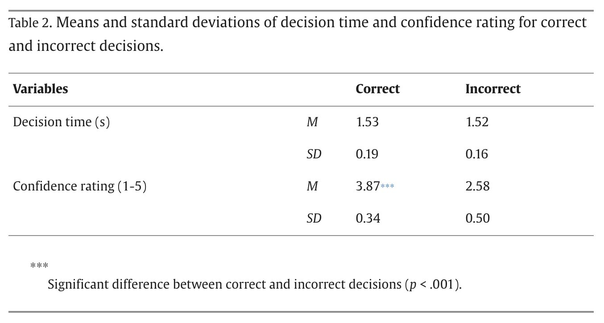
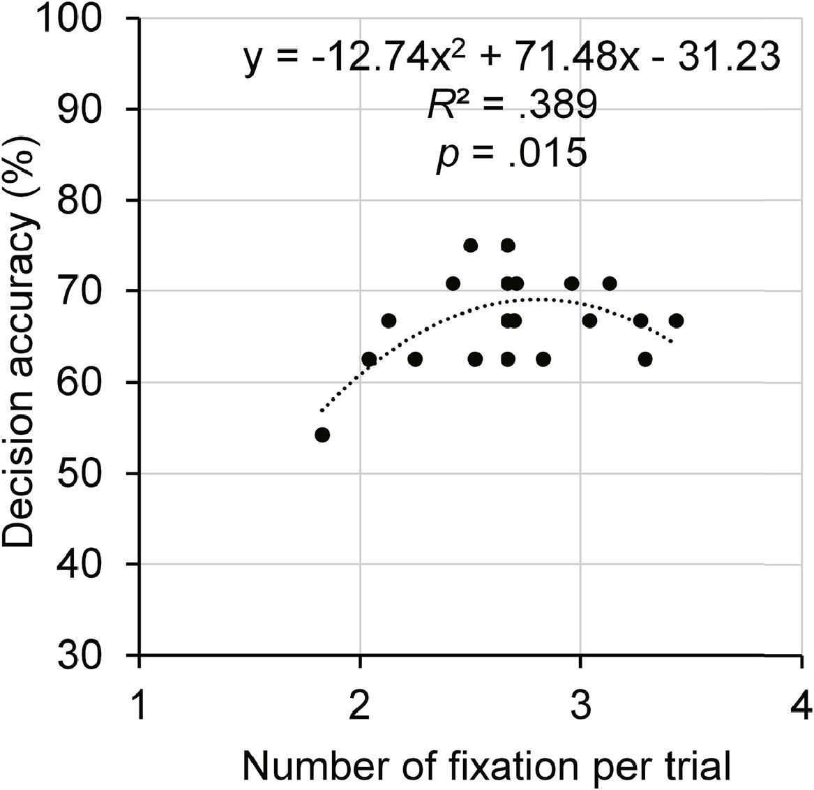
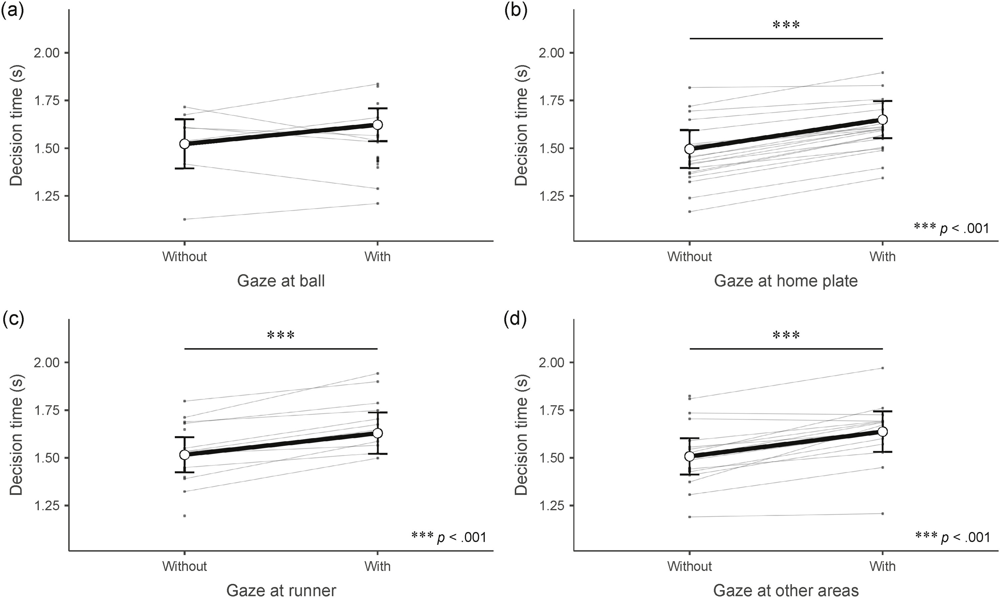
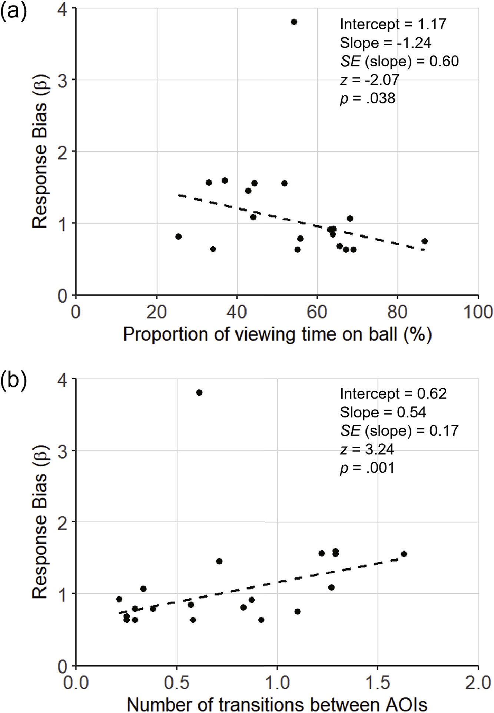

## Introduction

The purpose of the original paper "Gaze behavior and decision-making in simulated defensive situations for baseball fielders using a head-mounted display" was to investigate how visual attention influences decision-making performance in sport-specific context. Using a VR (Virtual Reality) simulation, the researchers examined how athletes gaze across different areas of interest (AOIs), such as the ball, home plate, and runners, and how the gaze patters relate to decision accuracy, decision time, and response bias.

The dataset used in this study includes both trial-level and participant-level measures of gaze behavior and decision-making performance. Key variables include decision time, confidence ratings, fixation counts, gaze allocation across AOIs, number of transitions between AOIs, and response bias.

The study conducted several types of analysis. Descriptive statistics, including means and standard deviations, were used to summarize decision time and confidence ratings across correct and incorrect trials. Inferential analysis included paired-samples t-tests to compare performance between correct and incorrect decisions, quadratic regression to examine nonlinear relationships between fixation behavior and decision accuracy, and linear mixed-effects models to assess the impact of gaze at different AOIs on decision time.

Decision accuracy was highest with an intermediate number of fixations per trial, while too few or too many fixations reduced accuracy. Gaze patterns revealed that players typically fixated on the ball at the start of each trial, while gaze directed to home plate, runner, or irrelevant areas prolonged decision time, and gaze directed to irrelevant areas reduced accuracy. Response bias (β) correlated with gaze behavior: longer ball fixations were associated with assertive decisions (throwing to home plate), whereas frequent gaze transitions predicted more conservative choices (throwing to first base). These findings suggest that both the stability and allocation of gaze play key roles in shaping decision-making under time constraints.

## Visualization of Data

Loading the data and the packages:

```{r}
# loading the necessary packages
library(dplyr)
library(ggplot2)
library(tidyr)
library(gt)
library(readr)
library(readxl)
library(patchwork)
library(MASS)
# The excel file has three differents, I can read all of them at once or load and store them as three different datasets, here I am loading them as separate data. 
Trial.Level <- read_excel("Datasets_Kokubu_2025.xlsx", sheet = "Trial-level data")
Participant.Level <- read_excel("Datasets_Kokubu_2025.xlsx", sheet = "Participant-level summary data")
Characteristics.Videos <- read_excel("Datasets_Kokubu_2025.xlsx", sheet = "Characteristics of videos")

#read the fist couple lines for each datasets
head(Trial.Level)
head(Participant.Level)
head(Characteristics.Videos)
```

## Statistical Replications/Raanalysis

I want to replicate Table 2:

{width="70%"}

To replicate Table 2, I will use the Trial-level data sheet for the means

```{r}
table2 <- Trial.Level |>
  filter(!is.na(`Result (1:Correct, 0:Incorrect)`), # keeping only the rows where all three of these variables have actual values and are not missing
         !is.na(`Decision time (sec)`),
         !is.na(`Confidence rating`)) |>
  mutate(
    Result = if_else(`Result (1:Correct, 0:Incorrect)` == 1, "Correct", "Incorrect")
  ) |> # creates a new variable called Result
  # if Result (1:Correct, 0:Incorrect) is 1, the new variable becomes "Correct", otherwise, it becomes "Incorrect"
  group_by(Result) |> # split the dataset into groups based on the new Result variable
  summarise(
    decision_time_M = mean(`Decision time (sec)`, na.rm = TRUE), # calculates the mean decision time for each group
    decision_time_SD = sd(`Decision time (sec)`, na.rm = TRUE), # standard deviation of decision time for each group
    confidence_M = mean(`Confidence rating`, na.rm = TRUE), # mean confidence rating for each group
    confidence_SD = sd(`Confidence rating`, na.rm = TRUE), # standard deviation of the confidence ratings for each group
    n = n() # counts how many rows of observations are in each group 
  )

table2
```

I can take it a step further and make it look as close to the graph on the paper as possible.

```{r}
table2_paper <- tibble(
  Variables = c("Decision time (s)", "", "Confidence rating (1-5)", ""), # creates the first column called Variables 
  Statistic = c("M", "SD", "M", "SD"), # creates the second column showing M = mean, SD = standard deviation
  Correct = c( # this column will contain values for correct decisions only
    mean(Trial.Level$`Decision time (sec)`[Trial.Level$`Result (1:Correct, 0:Incorrect)` == 1], na.rm = TRUE), # mean decision time for correct trials
    sd(Trial.Level$`Decision time (sec)`[Trial.Level$`Result (1:Correct, 0:Incorrect)` == 1], na.rm = TRUE), # standard deviation of decision time for correct trials
    mean(Trial.Level$`Confidence rating`[Trial.Level$`Result (1:Correct, 0:Incorrect)` == 1], na.rm = TRUE), # average confidence rating for correct trials
    sd(Trial.Level$`Confidence rating`[Trial.Level$`Result (1:Correct, 0:Incorrect)` == 1], na.rm = TRUE) # standard deviation of confidence ratings for correct trials
  ),
  Incorrect = c( # do the same for the incorrrect group 
    mean(Trial.Level$`Decision time (sec)`[Trial.Level$`Result (1:Correct, 0:Incorrect)` == 0], na.rm = TRUE),
    sd(Trial.Level$`Decision time (sec)`[Trial.Level$`Result (1:Correct, 0:Incorrect)` == 0], na.rm = TRUE),
    mean(Trial.Level$`Confidence rating`[Trial.Level$`Result (1:Correct, 0:Incorrect)` == 0], na.rm = TRUE),
    sd(Trial.Level$`Confidence rating`[Trial.Level$`Result (1:Correct, 0:Incorrect)` == 0], na.rm = TRUE)
  )
) %>%
  mutate(
    Correct = round(Correct, 2), # round the numbers, keep 2 decimal places
    Incorrect = round(Incorrect, 2)
  )

table2_paper
```

Next up I want to plot this:

{width="50%"}

```{r}
# plotting number of fixation per trail vs. decision accuracy
participant_accuracy <- Trial.Level |>
  group_by(`ParticipantID`) |> # groups the data by participant ID
  summarise(
    fixation_per_trial = mean(`Number of fixations per trial`, na.rm = TRUE), # calculates the average number of fixations per trial for each participant
    accuracy = mean(`Result (1:Correct, 0:Incorrect)`, na.rm = TRUE) * 100 # calculates decision accuracy for each participant, multiplying by 100 converts it into a percentage
  )

# quadratic regression model
quad_model2 <- lm(
  accuracy ~ fixation_per_trial + I(fixation_per_trial^2), # defines the model formula, accuracy = outcome, fixation_per_trial = predictor, I(fixation_per_trial^2 = squared term)
  data = participant_accuracy
)

summary(quad_model2) # prints a summary of the regression model

coefs <- coef(quad_model2) # extracts the regression coefficients
r2 <- summary(quad_model2)$r.squared # extracts the R^2 value
fstat <- summary(quad_model2)$fstatistic # extracts the F-statistic
pval <- pf(fstat[1], fstat[2], fstat[3], lower.tail = FALSE) # calculates the p-value for the model using F-statistic

p_label <- if(pval < .001){ # creates a formatted p-value string for the plot
  "p < .001" # if p < .001, display "p < .001"
} else { #otherwise, round to 3 decimals, removes leading zero
  paste0("p = ", sub("^0", "", sprintf("%.3f", pval)))
}

eq_label <- paste0( # create equation label for the plot
  "y = ",
  sprintf("%.2f", coefs[3]), "x² + ", # coef[3] = quadratic coefficient, formatted to 2 decimal places
  sprintf("%.2f", coefs[2]), "x ", # linear coefficient
  ifelse(coefs[1] < 0, "- ", "+ "), # if the sign of the intercept negative, use "-", if positive, use "+"
  sprintf("%.2f", abs(coefs[1])), # intercept
  "\nR² = ", sub("^0", "", sprintf("%.3f", r2)), # R^2 formatted to 3 decimals, removes leading zero
  "\n", p_label
)
```

After doing the math, now we can plot the data

```{r}
ggplot(participant_accuracy, aes(x = fixation_per_trial, y = accuracy)) +
  geom_point(shape = 16, size = 3, color = "black") + # shape = 16 -> solid circles, size = 3 -> controls point size
  stat_smooth(
    method = "lm", # lm = linear model
    formula = y ~ x + I(x^2), # linear term (x), quadratic term (y), this produces a curved trend line
    se = FALSE, # removes the shaded confidence interval around the line as the paper doesn't have it
    color = "black",
    linewidth = 0.8,
    linetype = "dotted"
  ) +
  annotate( # this adds text directly onto the plot
    "text",
    x = 3.9,   # push close to right edge
    y = 98,    # near top but inside
    label = eq_label,
    hjust = 1, # anchor text to the RIGHT
    vjust = 1, # anchor text to the TOP
    size = 5
  ) +
  coord_cartesian( # sets the visible range of the plot
    xlim = c(1, 4), # x-axis from 1 to 4
    ylim = c(30, 100), # y-axis from 30 to 100
    clip = "off" # allows texts to extend slightly outside the panel if needed
  ) +
  scale_x_continuous(
    limits = c(1, 4), # sets range
    breaks = c(1, 2, 3, 4), # controls tick marks
    expand = c(0, 0) # removes extra spacing at edges
  ) +
  scale_y_continuous(
    limits = c(30, 100),
    breaks = seq(30, 100, 10),# ticks every 10 units
    expand = c(0, 0)
  ) +
  labs(
    x = "Number of fixation per trial",
    y = "Decision accuracy (%)"
  ) +
  theme( # customize theme
    axis.title = element_text(size = 16),
    axis.text = element_text(size = 13, color = "black"),
    axis.line = element_line(linewidth = 0.8, color = "black"),
    axis.ticks = element_line(linewidth = 0.8, color = "black")
  )
```

Next, I want to replicate Figure 4:

{width="70%"}

We can plot one big figure to put all four visualizations in, but I prefer plotting four separate figures and then combine them together.

```{r}
# First we need four different data sets to work with
ball_data <- Trial.Level |>
  group_by(ParticipantID, GazeB) |> # participants that looked at the ball
  summarise(
    decision_time = mean(`Decision time (sec)`, na.rm = TRUE),
    .groups = "drop" # removes grouping afterward
  ) |>
  mutate( # creates a new variable named "gaze"
    gaze = if_else(GazeB == 1, "With", "Without"),
    area = "Gaze at ball"
  )

home_data <- Trial.Level |>
  group_by(ParticipantID, GazeH) |> # repeat the process, but for participants gaze at home plate
  summarise(
    decision_time = mean(`Decision time (sec)`, na.rm = TRUE),
    .groups = "drop"
  ) |>
  mutate(
    gaze = if_else(GazeH == 1, "With", "Without"),
    area = "Gaze at home plate"
  )

runner_data <- Trial.Level |>
  group_by(ParticipantID, GazeR) |> # gaze at runner
  summarise(
    decision_time = mean(`Decision time (sec)`, na.rm = TRUE),
    .groups = "drop"
  ) |>
  mutate(
    gaze = if_else(GazeR == 1, "With", "Without"),
    area = "Gaze at runner"
  )
  
other_data <- Trial.Level |>
  group_by(ParticipantID, GazeO) |> # gaze at other areas
  summarise(
    decision_time = mean(`Decision time (sec)`, na.rm = TRUE),
    .groups = "drop"
  ) |>
  mutate(
    gaze = if_else(GazeO == 1, "With", "Without"),
    area = "Gaze at other areas"
  )
```

With the separate datasets, we can now plot four separate figures. I made a repeatable function to plot the data.

```{r}
make_panel <- function(data, xlab) {
  ggplot(data, aes(x = gaze, y = decision_time, group = ParticipantID)) + 
    geom_line(color = "gray70", linewidth = 0.4) + # draws the lines connecting each participant's two points
    geom_point(color = "gray40", size = 1.2) + # adds points for each participant
    stat_summary( # adds a line showing the group mean
      fun = mean, # compute average
      geom = "line", # draw line
      aes(group = 1), # treats all data as one group
      color = "black",
      linewidth = 1.2
    ) +
    stat_summary( # adds points at the group mean
      fun = mean,
      geom = "point",
      shape = 21,
      fill = "white",
      color = "black",
      size = 3
    ) +
    stat_summary( # adds error bars showing standard error (SE)
      fun.data = mean_se,
      geom = "errorbar",
      width = 0.08,
      color = "black",
      linewidth = 0.8
    ) +
    coord_cartesian(ylim = c(1.0, 2.2)) + # defines the visible y-axis range
    scale_y_continuous(breaks = c(1.25, 1.50, 1.75, 2.00)) + # sets specific tick marks on the y-axis
    labs( # set axis labels
      x = xlab,
      y = "Decision time (s)"
    ) +
    theme_classic(base_size = 16) + # remove gridlines 
    theme(
      axis.title.x = element_text(size = 14),
      axis.title.y = element_text(size = 14),
      axis.text = element_text(size = 12)
    )
}
```

With this function, we can now plot the four data sets and combine them into one big graph.

```{r}
#| warning: false
#| message: false
# using the function make_panel to create plots for each categories
p_ball <- make_panel(ball_data, "Gaze at ball")
p_home <- make_panel(home_data, "Gaze at home plate")
p_runner <- make_panel(runner_data, "Gaze at runner")
p_other <- make_panel(other_data, "Gaze at other areas")

p_ball <- p_ball + # add panel label (a) to the top-left of the ball plot
  annotate("text", x = 0.8, y = 2.18, label = "(a)", size = 6)

p_home <- p_home +
  annotate("text", x = 0.8, y = 2.18, label = "(b)", size = 6) # adds (b) 

p_runner <- p_runner +
  annotate("text", x = 0.8, y = 2.18, label = "(c)", size = 6) # adds (c)

p_other <- p_other +
  annotate("text", x = 0.8, y = 2.18, label = "(d)", size = 6) # adds (d)

# combine four graphs together
final_fig <- (p_ball | p_home) / (p_runner | p_other) # "/" means stack rows vertically
final_fig
```

Lastly, I want to plot Figure 5:

{width="50%"}

Again, instead of plotting both at the same time, I am going to plot them differently and then put them together.

```{r}
# this dataset will be used for the robust regression and scatterplots
fig5_data <- Participant.Level |>
  transmute( # creates a new dataset with only selected variables
    id = ID,
    response_bias = `β`,
    prob_ball_pct = `Proportion of viewing time spent on ball (B)` * 100,
    transitions = `Number of transitions between AOIs`
  ) |>
  filter( # remove missing values
    !is.na(response_bias),
    !is.na(prob_ball_pct),
    !is.na(transitions)
  )

# create model objects
mod_a <- rlm( # rlm = robust linear regression from the MASS package
  response_bias ~ prob_ball_pct, # unlike lm(), it reduces the influence of outliers
  data = fig5_data,
  psi = psi.huber # Huber's ψ-function, gives normal weight to most observations
)
# repeat the process for model b 
mod_b <- rlm(
  response_bias ~ transitions, 
  data = fig5_data,
  psi = psi.huber
)
```

Now we can extract all the values we need for the figures

```{r}
# extract model summaries
sum_a <- summary(mod_a)
sum_b <- summary(mod_b)

# extract coefficients
coef_a <- coef(mod_a)
coef_b <- coef(mod_b)

# extract standard errors
se_a <- sum_a$coefficients[2, 2]
se_b <- sum_b$coefficients[2, 2]

# extract z-values for the slope
z_a <- sum_a$coefficients[2, 3]
z_b <- sum_b$coefficients[2, 3]

# calculate p-values
p_a <- 2 * pnorm(abs(z_a), lower.tail = FALSE)
p_b <- 2 * pnorm(abs(z_b), lower.tail = FALSE)

# building the label
label_a <- paste0( # combines multiple pieces of text into one string
  "Intercept = ", sprintf("%.2f", coef_a[1]), "\n", # intercept from model A, formats number to 2 decimal places, adds a new line
  "Slope = ", sprintf("%.2f", coef_a[2]), "\n", # slope line
  "SE (slope) = ", sprintf("%.2f", se_a), "\n", # standard error line
  "z = ", sprintf("%.2f", z_a), "\n", # z-value line
  "p = ", sub("^0", "", sprintf("%.3f", p_a)) # p-value line
)
# example output: Intercept = 1.17

# repeat the process for B
label_b <- paste0(
  "Intercept = ", sprintf("%.2f", coef_b[1]), "\n",
  "Slope = ", sprintf("%.2f", coef_b[2]), "\n",
  "SE (slope) = ", sprintf("%.2f", se_b), "\n",
  "z = ", sprintf("%.2f", z_b), "\n",
  "p = ", sub("^0", "", sprintf("%.3f", p_b))
)
```

Now that we have all the values needed, we can plot the figures

```{r}
# Panel A
p_a <- ggplot(fig5_data, aes(x = prob_ball_pct, y = response_bias)) +
  geom_point(size = 2, color = "black") +
  geom_abline(
    intercept = coef_a[1], # adds the regression line using values from model A
    slope = coef_a[2],
    linetype = "dashed", # styles the regression line
    linewidth = 0.6,
    color = "black"
  ) +
  # adds the regression results 
  annotate("text", x = 70, y = 3.6, label = label_a, hjust = 0, vjust = 1, size = 4.5) +
  annotate("text", x = -5, y = 4.1, label = "(a)", size = 7) + # adds panel label (a)
  coord_cartesian(xlim = c(0, 100), ylim = c(0, 4), clip = "off") + # set plot limits
  labs(
    x = "Proportion of viewing time on ball (%)",
    y = "Response Bias (\u03b2)"
  ) +
  theme(plot.margin = margin(10, 20, 10, 10)) # adds margins, extra space on right

# Repeat the process for Panel B
p_b <- ggplot(fig5_data, aes(x = transitions, y = response_bias)) +
  geom_point(size = 2, color = "black") +
  geom_abline(
    intercept = coef_b[1],
    slope = coef_b[2],
    linetype = "dashed",
    linewidth = 0.6,
    color = "black"
  ) +
  annotate("text", x = 1.35, y = 3.6, label = label_b, hjust = 0, vjust = 1, size = 4.5) +
  annotate("text", x = -0.1, y = 4.1, label = "(b)", size = 7) +
  coord_cartesian(xlim = c(0, 2), ylim = c(0, 4), clip = "off") +
  labs(
    x = "Number of transitions between AOIs",
    y = "Response Bias (\u03b2)"
  ) +
  theme(plot.margin = margin(10, 20, 10, 10))

# combine two figures together
fig5 <- p_a / p_b
fig5
```

## Summary/Discussion

The replication went fairly successful, although replicating the exact number the authors created was merely impossible, as lots of factors were taking into account. The challenges I have faced during the process is the fight the exact same visualization as the authors used.

Minor differences between the replicated and original results likely reflect differences in data preprocessing, implementation of robust regression, and the sensitivity of small samples to individual observations. Because the original paper does not fully document all analytic decisions, exact numerical replication is difficult. However, the replicated results were consistent in direction and overall interpretation, supporting the robustness of the original findings.

## References

Afonso, J., Garganta, J., McRobert, A., Williams, A. M., & Mesquita, I. (2012). The perceptual cognitive processes underpinning skilled performance in volleyball: Evidence from eye-movements and verbal reports of thinking involving an in situ representative task. Journal of Sports Science and Medicine, 11, 339–345.

Broadbent, D. P., Causer, J., Williams, A. M., & Ford, P. R. (2015). Perceptual-cognitive skill training and its transfer to expert performance in the field: Future research directions. European Journal of Sport Science, 15, 322–331. https://doi.org/10.1080/17461391.2014.957727

Bruce, L., Farrow, D., Raynor, A., & Mann, D. (2012). But I can’t pass that far! The influence of motor skill on decision making. Psychology of Sport and Exercise, 13, 152–161. https://doi.org/10.1016/j.psychsport.2011.10.005

Canal-Bruland, R., Balch, L., & Niesert, L. (2015). Judgement bias in predicting the success of one’s own basketball free throws but not those of others. Psychological Research, 79, 548–555. https://doi.org/10.1007/s00426-014-0592-2

Canal-Bruland, R., & Schmidt, M. (2009). Response bias in judging deceptive movements. Acta Psychologica, 130, 235–240. https://doi.org/10.1016/j.actpsy.2008.12.009

Catteeuw, P., Helsen, W., Gilis, B., Van Roie, E., & Wagemans, J. (2009). Visual scan patterns and decision-making skills of expert assistant referees in offside situations. Journal of Sport and Exercise Psychology, 31, 786–797. https://doi.org/10.1123/jsep.31.6.786

DeCouto, B. S., Fawver, B., Thomas, J. L., Williams, A. M., & Vater, C. (2023). The role of peripheral vision during decision-making in dynamic viewing sequences. Journal of Sports Sciences, 41, 1852–1867. https://doi.org/10.1080/02640414.2023.2301143

Dicks, M., Button, C., & Davids, K. (2010). Examination of gaze behaviors under in situ and video simulation task constraints reveals differences in information pickup for perception and action. Attention, Perception, & Psychophysics, 72, 706–720. https://doi.org/10.3758/APP.72.3.706

Farrow, D., & Abernethy, B. (2003). Do expertise and the degree of perception-action coupling affect natural anticipatory performance? Perception, 32, 1127–1139. https://doi.org/10.1068/p3323

Gray, R. (2010). Expert baseball batters have greater sensitivity in making swing decisions. Research Quarterly for Exercise and Sport, 81, 373–378. https://doi.org/10.1080/02701367.2010.10599685

Green, D. M., & Swets, J. A. (1966). Signal detection theory and psychophysics. New York: Wiley. Asia Journal of Sport and Exercise Psychology 5 (2025) 107–116

Green, P., & MacLeod, C. J. (2016). SIMR: an R package for power analysis of generalizedlinear mixed models by simulation. Methods in Ecology and Evolution, 7, 493–498. https://doi.org/10.1111/2041-210X.12504

Hancock, D. J., & Ste-Marie, D. M. (2013). Gaze behaviors and decision making accuracy of higher- and lower-level ice hockey referees. Psychology of Sport and Exercise, 14, 66–71. https://doi.org/10.1016/j.psychsport.2012.08.002

Helsen, W., & Pauwels, J. M. (1993). Chapter 7 The relationship between expertise and visual information processing in sport. In J. L. Starkes, & F. Allard (Eds.), Cognitive Issues in Motor Expertise (pp. 109–134). North-Holland.

Hepler, T. J., & Feltz, D. L. (2012). Path analysis examining self-efficacy and decision-making performance on a simulated baseball task. Research Quarterly for Exercise and Sport, 83, 55–64. https://doi.org/10.1080/02701367.2012.10599825

Jackson, R. C., Barton, H., Ashford, K. J., & Abernethy, B. (2018). Stepovers and signal detection: Response sensitivity and bias in the differentiation of genuine and deceptive football actions. Frontiers in Psychology, 9, 2043. https://doi.org/10.3389/fpsyg.2018.02043

Jackson, R. C., Barton, H., & Bishop, D. T. (2020). Knowledge is power? Outcome probability information impairs detection of deceptive intent. Psychology of Sport and Exercise, 50, Article 101744. https://doi.org/10.1016/j.psychsport.2020.101744

Jia, Y., Zhou, X., Yang, J., & Fu, Q. (2024). Animated VR and 360-degree VR to assess and train team sports decision-making: A scoping review. Frontiers in Psychology, 15, Article 1410132. https://doi.org/10.3389/fpsyg.2024.1410132

Kato, T. (2020). Using “Enzan No Metsuke” (gazing at the far mountain) as a visual search strategy in Kendo. Frontiers in Sports and Active Living, 2, 40. https://doi.org/10.3389/fspor.2020.00040

Kiani, R., Corthell, L., & Shadlen, M. N. (2014). Choice certainty is informed by both evidence and decision time. Neuron, 84, 1329–1342. https://doi.org/10.1016/j.neuron.2014.12.015

Kikumasa, S., & Kokubu, M. (2018). Decision-making and visual search strategy of baseball catchers in a situation of giving directions on a play. Japanese Journal of Sport Psychology, 45, 27–41. https://doi.org/10.4146/jjspopsy.2017-1707

Kishita, Y., Ueda, H., & Kashino, M. (2020). Eye and head movements of elite baseball players in real batting. Frontiers in Sports Active Living, 2, 3. https://doi.org/10.3389/fspor.2020.00003

Lee, J., Kim, H., & Kim, G. J. (2024). Keep your eyes on the target: Enhancing immersion and usability by designing natural object throwing with gaze-based targeting. In Proceedings of the 2024 Symposium on Eye Tracking Research and Applications, Glasgow, United Kingdom. https://doi.org/10.1145/3649902.3653338

Macmillan, N. A., & Creelman, C. D. (2005). Detection theory: A user’s guide (2nd ed.). Lawrence Erlbaum Associates Publishers.

Mann, D. L., Abernethy, B., & Farrow, D. (2010). Action specificity increase anticipatory performance and the expert advantage in natural interceptive tasks. Acta Psychologica, 135, 17–23. https://doi.org/10.1016/j.actpsy.2010.04.006

Mann, D. T., Williams, A. M., Ward, P., & Janelle, C. M. (2007). Perceptual-cognitive expertise in sport: A meta-analysis. Journal of Sport and Exercise Psychology, 29, 457–478. https://doi.org/10.1123/jsep.29.4.457

Martell, S. G., & Vickers, J. N. (2004). Gaze characteristics of elite and near-elite athletes in ice hockey defensive tactics. Human Movement Science, 22, 689–712. https://doi. org/10.1016/j.humov.2004.02.004

Mori, S., & Ono, M. (2023). Timecourse of two-dimensional decision-making to offensive actions. Experimental Brain Research, 241, 2521–2534. https://doi.org/10.1007/s00221-023-06701-x

Nagano, T., Kato, T., & Fukuda, T. (2004). Visual search strategies of soccer players in one-on-one defensive situations on the field. Perceptual and Motor Skills, 99, 968–974. https://doi.org/10.2466/pms.99.3.968-974

Natsuhara, T., Kato, T., Nakayama, M., Yoshida, T., Sasaki, R., Matsutake, T., & Asai, T. (2020). Decision-making while passing and visual search strategy during ball receiving in team sport play. Perceptual and Motor Skills, 127, 468–489. https://doi.org/10.1177/0031512519900057

Norman, G. (2010). Likert scales, levels of measurement and the “laws” of statistics. Advances in Health Sciences Education, 15, 625–632. https://doi.org/10.1007/s10459-010-9222-y

Panchuk, D., Klusemann, M. J., & Hadlow, S. M. (2018). Exploring the effectiveness of immersive video for training decision-making capability in elite, youth basketball players. Frontiers in Psychology, 9, 2315. https://doi.org/10.3389/fpsyg.2018.02315

Piras, A., Lanzoni, I. M., Raffi, M., Persiani, M., & Squatrio, S. (2016). The within task criterion to determine successful and unsuccessful table tennis players. International Journal of Sports Science & Coaching, 11, 523–531. https://doi.org/10.1177/1747954116655050

Piras, A., Lobietti, R., & Squatrito, S. (2014). Response time, visual search strategy, and anticipatory skills in volleyball players. Journal of Ophthalmology, 9, 185–197. https://doi.org/10.1155/2014/189268

Piras, A., & Vickers, J. N. (2011). The effect of fixation transitions on quiet eye duration and performance in the soccer penalty kick: Instep versus inside kicks. Cognitive Processing, 12, 245–255. https://doi.org/10.1007/s10339-011-0406-z

Regan, D., & Vincent, A. (1995). Visual processing of looming and time to contact throughout the visual field. Vision Research, 35, 1845–1857. https://doi.org/10.1016/0042-6989(94)00274-p

Ripoll, H., Kerlirzin, Y., Stein, J. F., & Reine, B. (1995). Analysis of information processing, decision making, and visual strategies in complex problem solving sport situations. Human Movement Science, 14, 325–349. https://doi.org/10.1016/0167-9457(95)00019-O

Rivilla-Garcia, J., Munoz, A., Grande, I., Almenara, M. S., & Sampedro, J. (2013). A comparative analysis of visual strategy in elite and amateur handball goalkeepers. Journal of Human Sport and Exercise, 8, 743–753. https://doi.org/10.4100/jhse.2013.8.proc3.21

Roca, A., Ford, P. R., McRobert, A. P., & Williams, A. M. (2011). Identifying the processes underpinning anticipation and decision-making in a dynamic time-constrained task. Cognitive Processing, 12, 301–310. https://doi.org/10.1007/s10339-011-0392-1

Roca, A., Ford, P. R., McRobert, A. P., & Williams, A. M. (2013). Perceptual-cognitive skills and their interaction as a function of task constraints in soccer. Journal of Sport and Exercise Psychology, 35, 144–155. https://doi.org/10.1123/jsep.35.2.144

Roca, A., Williams, A. M., & Ford, P. R. (2012). Developmental activities and the acquisition of superior anticipation and decision making in soccer players. Journal of Sports Sciences, 29, 575–582. https://doi.org/10.1080/02640414.2012.701761

Savelsbergh, G. J. P., Van der Kamp, J., Williams, A. M., & Ward, P. (2005). Anticipation and visual search behavior in expert soccer goalkeepers. Ergonomics, 48, 11–14. https://doi.org/10.1080/00140130500101346

Savelsbergh, G. J. P., Williams, A. M., Van Der Kamp, J., & Ward, P. (2002). Visual search, anticipation and expertise in soccer goalkeepers. Journal of Sports Sciences, 20, 279–287. https://doi.org/10.1080/026404102317284826

Stein, N., Niehorster, D. C., Watson, T., Steinicke, F., Rifai, K., Wahl, S., & Lappe, M. (2021). A Comparison of eye tracking latencies among several commercial head mounted displays. I-Perception, 12, 1–16. https://doi.org/10.1177/2041669520983

Takeuchi, T., & Inomata, K. (2009). Visual search strategies and decision making in baseball batting. Perceptual and Motor Skills, 108, 971–980. https://doi.org/10.2466/pms.108.3.971-980

Toole, A. J., & Fogt, N. (2021). Review: Head and eye movements and gaze tracking in baseball batting. Optometry and Vision Science: Official Publication of the American Academy of Optometry, 98, 750–758. https://doi.org/10.1097/OPX.0000000000001721

Vaeyens, R., Lenoir, M., Williams, A. M., Mazyn, L., & Philippaerts, R. M. (2007a). The effects of task constraints on visual search behavior and decision-making skill in Asia Journal of Sport and Exercise Psychology 5 (2025) 107–116 youth soccer players. Journal of Sport and Exercise Psychology, 29, 147–169. https://doi.org/10.1123/jsep.29.2.147

Vaeyens, R., Lenoir, M., Williams, A. M., & Philippaerts, R. M. (2007b). Mechanisms underpinning successful decision making in skilled youth soccer players: An analysis of visual search behaviors. Journal of Motor Behavior, 39, 395–408. https://doi.org/10.3200/JMBR.39.5.395-408

van Maarseveen, M. M. J., Savelsbergh, G. J. P., & Oudejans, R. R. D (2018). In situ examination of decision-making skills and gaze behavior of basketball players. Human Movement Science, 57, 205–216. https://doi.org/10.1016/j.humov.2017.12.006

Vansteenkiste, P., Vaeyens, R., Zeuwts, L., Philippaerts, R., & Lenoir, M. (2014). Cue. usage in volleyball: A time course comparison of elite, intermediate and novice female players. Biology of Sport, 31, 295–302. https://doi.org/10.5604/20831862.1127288

Vickers, J. N. (2007). Perception, cognition, and decision training: The quiet eye in action. Human Kinetics.

Williams, A. M., & Davids, K. (1998). Visual search strategy, selective attention, and expertise in soccer. Research Quarterly for Exercise and Sport, 69, 111–128. https://doi.org/10.1080/02701367.1998.10607677

Williams, A. M., Davids, K., Burwitz, L., & Williams, J. G. (1999). Visual search strategies in experienced and inexperienced soccer players. Research Quarterly for Exercise and Sport, 70, 117–131. https://doi.org/10.1080/02701367.1994.10607607

Williams, A. M., & Ericsson, K. A. (2005). Perceptual-cognitive expertise in sport: Some considerations when applying the expert performance approach. Human Movement Science, 24, 283–307. https://doi.org/10.1016/j.humov.2005.06.002

Ziv, G. (2025). Visual search theories and their relevance to sport performance. In G. Ziv, & R. Lidor (Eds.), Gaze and visual perception in sport (pp. 11–22). Routledge. https://doi.org/10.4324/9781032708973.
